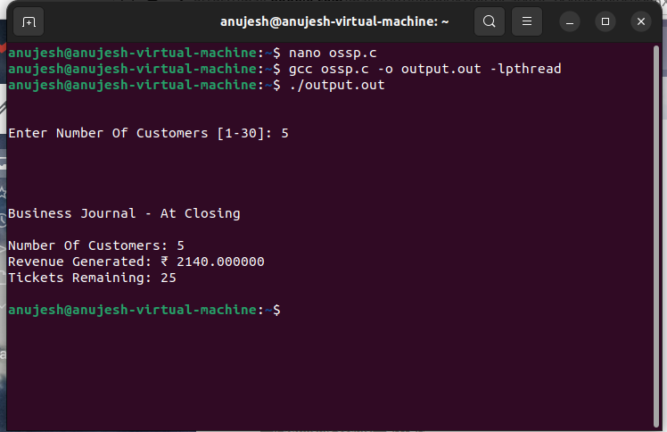

# 🍦 Ice Cream Shop Simulation: A Journey into Threading and Synchronization

Welcome to the **Ice Cream Shop Simulation**, a project designed to take you into the heart of threading, synchronization, and resource management using the C programming language. This simulation isn't just about scooping ice cream; it's about showcasing how multiple customers interact in a shared environment, accessing resources like flavors, toppings, and tickets in real-time without conflicts. Dive into this experience to learn the intricacies of process synchronization and how to prevent race conditions in a multi-user environment.

## 🧠 **Why This Project Matters**

In today’s world, where multiple users interact with shared systems simultaneously, understanding process synchronization is crucial. This project simulates a real-world scenario where multiple customers (threads) access shared resources in an ice cream shop. By implementing concepts like threading, semaphores, and real-time feedback, this simulation offers a practical demonstration of how to manage shared resources efficiently, ensuring a seamless experience without conflicts.

## 🎯 **Project Objectives**

### Threading Implementation
- Employ **POSIX threads** to simulate each customer as an individual thread, creating a bustling ice cream shop environment where multiple customers interact concurrently.

### Resource Management
- Utilize **semaphores** to manage shared resources such as tickets, flavors, toppings, and the shop’s revenue, ensuring fair and regulated access among all customers.

### Race Condition Avoidance
- Implement robust synchronization mechanisms to prevent race conditions, ensuring multiple customers can access resources like flavors and toppings without conflicts.

### Real-time Feedback Integration
- Incorporate **system calls** for real-time feedback, providing immediate updates on customer actions like ticket acquisition, flavor selection, billing, and departure.

### Educational Demonstration
- Serve as an educational tool that illustrates the importance of process synchronization in multi-user environments, helping users understand the role of synchronization techniques in resource management.

### Practical Application Scenario
- Demonstrate real-world applications by replicating an ice cream shop scenario, showing how synchronization ensures conflict-free and fair resource allocation.

### Accuracy and Realism
- Create an immersive and realistic simulation, accurately replicating an actual ice cream shop environment to enhance understanding of synchronization concepts.

### Educational Value
- Provide an in-depth understanding of threading and synchronization, offering insights into managing shared resources and preventing race conditions in a dynamic, multi-user environment.

---

## 🔍 **Simulation Example**

### How It Works

1. **Multithreading Setup**: The simulation uses **POSIX threads** (`pthread.h`) to represent each customer as a thread. This allows multiple customers to interact concurrently, reflecting a busy ice cream shop environment.
2. **Resource Management**: Semaphores (`semaphore.h`) regulate access to shared resources such as tickets, flavors, toppings, and revenue.
3. **Avoidance of Race Conditions**: Synchronization mechanisms are used to prevent conflicts when multiple customers vie for the same resource.
4. **Real-time Feedback**: System calls (`syscall.h`) provide real-time feedback for every action a customer takes, such as selecting flavors, choosing toppings, and completing the transaction.

### Example Steps

**Step 1: Customers Enter the Shop**
- Each customer thread begins by acquiring a ticket.

**Step 2: Flavor and Topping Selection**
- Customers select their preferred flavors and toppings.

**Step 3: Billing and Checkout**
- Customers complete the transaction, and revenue is updated in real-time.

### Output

Run ossp.c on Linux Terminal

---

## ⚙️ **Built With**

- **Programming Language**: C
- **Threading Library**: POSIX Threads (`pthread.h`)
- **Synchronization Tools**: Semaphores (`semaphore.h`)
- **System Calls**: For real-time feedback (`syscall.h`)
- **Development Environment**: Linux/Unix Terminal

---

## 🛠️ **Methodology and Implementation**

### Overview of Implementation:
1. **Multithreading Setup**: Utilizes POSIX threads to simulate multiple customers in the shop.
2. **Resource Management**: Semaphores regulate access to resources such as tickets, flavors, and toppings.
3. **Avoidance of Race Conditions**: Prevents conflicts using local thread variables.
4. **Customer Interaction**: Threads represent customers acquiring tickets, selecting flavors, and completing transactions.
5. **Real-time Feedback**: Uses system calls to provide real-time customer actions.
6. **Business Metrics**: Tracks overall revenue and remaining tickets as customers complete transactions.
7. **Cleanup and Exit**: Properly terminates threads and releases semaphores when the shop closes.

---

## 👩‍💻 **Author**

- **Khushi Goel** - [GitHub Profile](https://github.com/khushigoel)

---

## 🙌 **Acknowledgments**

Special thanks to:
- Our instructors for their guidance on threading and synchronization techniques.
- Online resources like [GeeksforGeeks](https://www.geeksforgeeks.org/introduction-of-process-synchronization/) for providing valuable insights into process synchronization.
- Open-source communities for their support and contributions.

---

## 📚 **Educational Value**

This project serves as an educational tool that illustrates how threading and synchronization work together to manage shared resources effectively. It provides a real-world simulation that helps users understand:
- The challenges of resource management in a multi-user environment.
- How to implement synchronization techniques to avoid conflicts and race conditions.

---

## 📈 **Business Metrics and Outcomes**

- Tracks overall revenue generated during the simulation.
- Monitors remaining tickets and the progress of each customer.
- Provides real-time feedback, ensuring a realistic and educational experience.

---

## 🏁 **Conclusion**

The **Ice Cream Shop Simulation** is more than just a project; it’s an exploration into the world of threading and synchronization. By using POSIX threads and semaphores, this simulation demonstrates how to manage shared resources in a dynamic, multi-user environment efficiently. It highlights the importance of process synchronization, showing how it ensures fairness, prevents race conditions, and provides a seamless experience for all users.

This project stands as a practical example of synchronization in action, making it an invaluable educational resource for those interested in understanding threading and shared resource management.

---

## 🔗 **References**

1. [Introduction of Process Synchronization](https://www.geeksforgeeks.org/introduction-of-process-synchronization/)
2. [Race Condition Vulnerability](https://www.geeksforgeeks.org/race-condition-vulnerability/)

---

Feel free to fork this repository, experiment with the code, and even enhance the simulation further. Happy coding, and may your threading journey be as smooth as your ice cream scoops! 🍦
